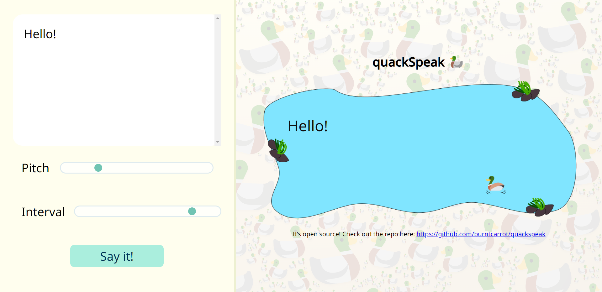

# [quackspeak](https://quackspeak.vercel.app/)

Text-to-speech using ducks. 🦆



## Why?

Why not? Just type and hear some quacks.

## Local development

Use a live server, maybe like this:

```
python3 -m http.server <port>
```

## Customization

You can fork and add new sounds. I do have some sample sounds lying around, feel free to take a look at them!

Most of the sounds are loaded on init - a nice addition would be to add a dropdown to select from!

## Sounds

All sound files were acquired from [freesound.org](https://freesound.org/).

Sound files are licensed under [CC0 1.0](https://creativecommons.org/publicdomain/zero/1.0/)

## License

`quackspeak` is licensed under the [MIT License](LICENSE).
